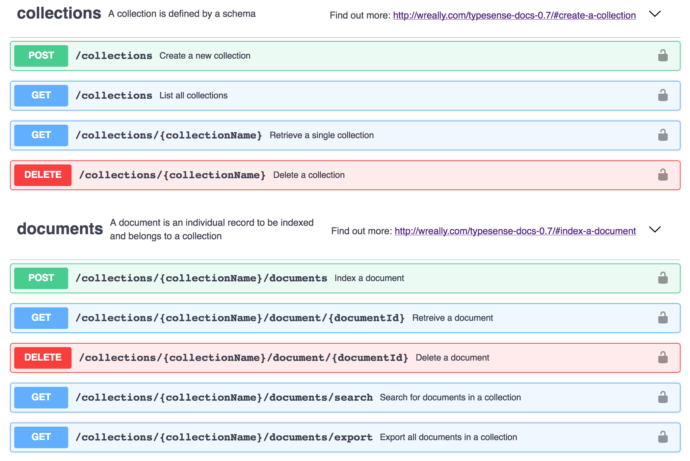
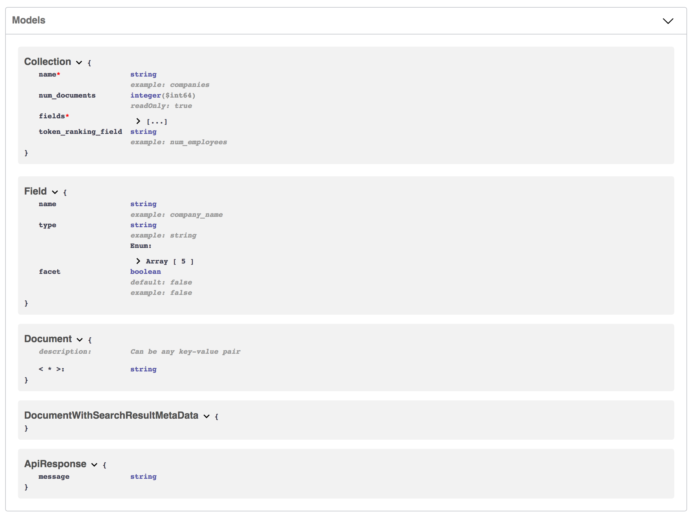

# Typesense API Specs

This repository contains the API specs for the Typesense HTTP API.

## Usage

You can use Swagger Editor to view/edit the API spec files:

```
$ docker run -p 8080:8080 swaggerapi/swagger-editor
```

Now visit localhost:8080 in your browser, File -> Import File and select the spec file in this repository.

## API Routes



## API Data Models




